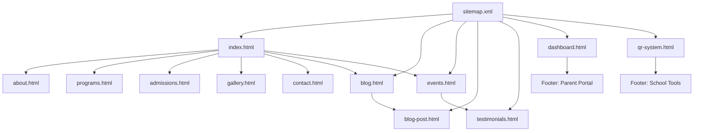
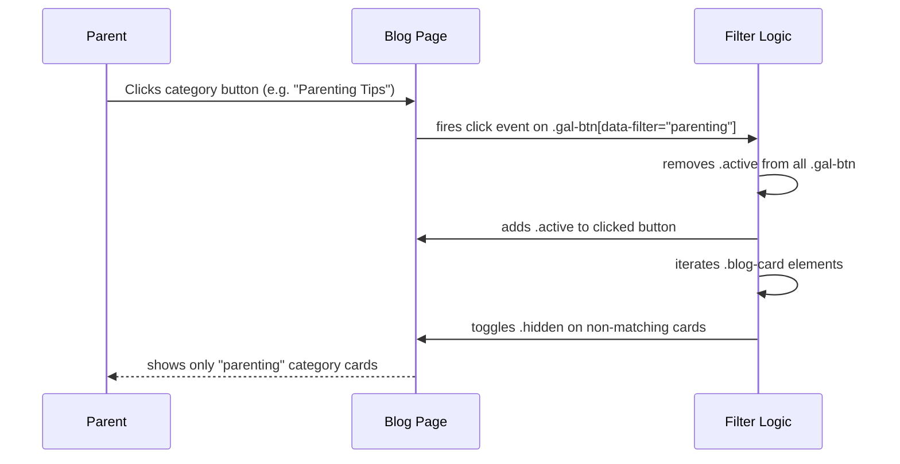
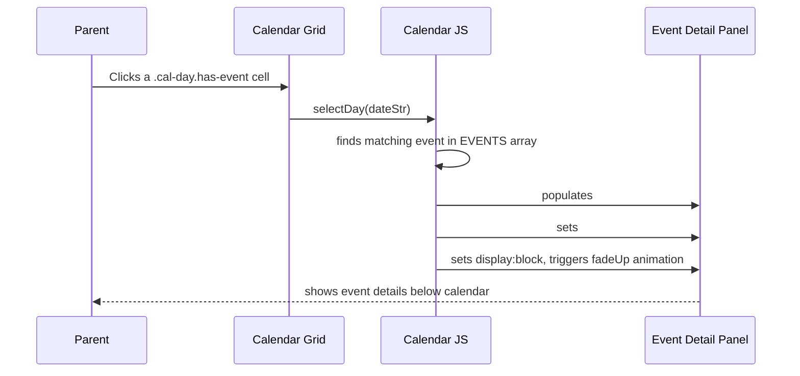
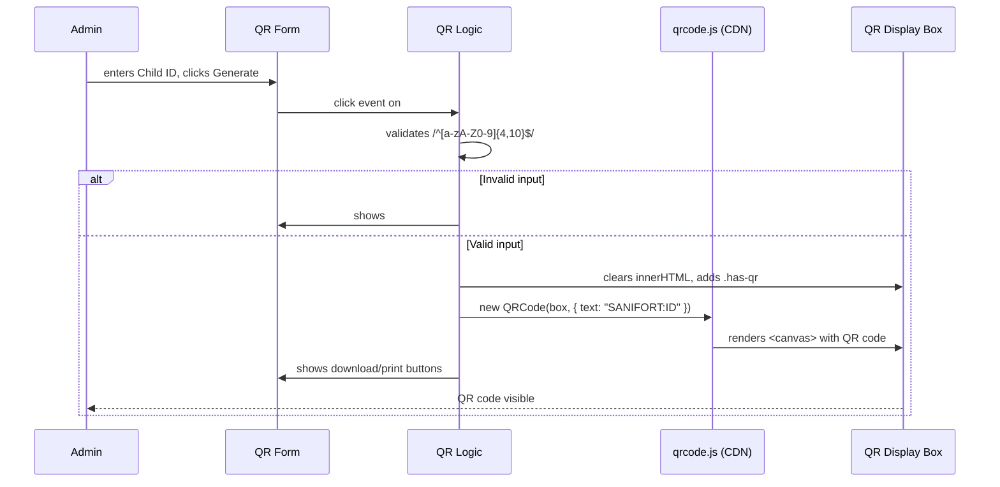

# Design Document: Sanifort Pre-School Digital Platform

## Overview

This document specifies the complete design for upgrading the Sanifort Pre-School website into a full digital educational platform. The existing site (6 pages, premium HTML/CSS/JS) is extended with 6 new pages, enhancements to 3 existing pages, design system additions, SEO structured data, and navigation/footer restructuring. All new work inherits the existing design system (CSS variables, component classes, font stack, animation patterns) without modification to the core system.

Target audience: parents aged 25–40 in Hanumangarh, Rajasthan, searching on mobile for the best preschool. Every new page is mobile-first, collapses to single column at ≤480px, and uses the existing `.reveal` scroll animation pattern.


## Architecture



All pages share:
- `css/style.css` (extended, not replaced)
- `js/main.js` (extended per-page with inline `<script>` blocks)
- Standard navbar, WhatsApp button, footer markup patterns


---

## Design System Additions (css/style.css)

All additions are appended after the existing `@media (max-width: 480px)` block. No existing rules are modified.

### Responsive Breakpoint Comments

```css
/* ── BREAKPOINTS ──
   Mobile  : ≤ 480px
   Tablet  : 481px – 768px
   Desktop : ≥ 769px
── */
```

### `.page-section` Utility

```css
.page-section {
  padding: 90px 0;
  background: var(--section-bg, var(--white));
}
```

Usage: `<section class="page-section" style="--section-bg: var(--bg-soft);">`

### `.badge` Component

```css
.badge {
  display: inline-flex; align-items: center; gap: 5px;
  padding: 4px 14px; border-radius: var(--pill);
  font-size: 0.75rem; font-weight: 800; letter-spacing: .5px;
  text-transform: uppercase;
}
.badge-yellow { background: rgba(255,217,61,.2);  color: #92400E; }
.badge-blue   { background: rgba(74,144,217,.15); color: #1E40AF; }
.badge-green  { background: rgba(107,203,119,.2); color: #166534; }
.badge-pink   { background: rgba(244,114,182,.2); color: #9D174D; }
```

### `.card-hover` Utility

```css
.card-hover { transition: var(--t); }
.card-hover:hover { transform: translateY(-8px); box-shadow: var(--s3); }
```

Applied to any card that needs the standard lift effect. Replaces per-component hover rules on new pages.


---

## Navigation Restructure

### Navbar (All Pages)

7 nav items + CTA. The existing `.nav-links` gap is `2px` and each link uses `padding: 8px 15px`, so 7 items fit comfortably at desktop widths ≥ 900px. On mobile the hamburger menu already handles overflow.

```html
<ul class="nav-links" id="navLinks">
  <li><a href="index.html">Home</a></li>
  <li><a href="about.html">About Us</a></li>
  <li><a href="programs.html">Programs</a></li>
  <li><a href="admissions.html">Admissions</a></li>
  <li><a href="gallery.html">Gallery</a></li>
  <li><a href="blog.html">Blog</a></li>
  <li><a href="contact.html">Contact</a></li>
  <li><a href="admissions.html" class="nav-cta">Enroll Now</a></li>
</ul>
```

Active page gets `class="active"` on its `<a>` tag. No structural CSS changes needed — the existing `.nav-links` flex layout accommodates 7 items.

### Footer (All Pages)

5-column grid replacing the existing 4-column `footer-grid`. New CSS rule:

```css
.footer-grid { grid-template-columns: 2fr 1fr 1fr 1fr 1fr; }
```

Column layout:
1. Brand (logo, tagline, social icons) — `2fr`
2. Quick Links (Home, About, Programs, Admissions, Gallery, Blog, Testimonials, Events, Contact)
3. Programs (Playgroup, Nursery, Kindergarten)
4. School Tools (Parent Portal → dashboard.html, QR System → qr-system.html)
5. Contact Us (address, phone, email, hours)

At ≤1024px: `grid-template-columns: 1fr 1fr` (existing rule updated to handle 5 cols → 2 cols).
At ≤768px: `grid-template-columns: 1fr` (existing rule unchanged).


---

## Page 1: blog.html — Blog Listing

### Layout

```
[Page Hero — gradient: coral → sky]
[Filter Bar + Search Row]
[Post Cards Grid]
[Pagination / Load More]
[CTA Banner]
[Footer]
```

### Page Hero

Background: `linear-gradient(135deg, var(--coral) 0%, var(--sky) 100%)`
Decorative emojis: 📝 📚 ✏️ 🌟
Title: `Our <span>Blog</span>` | Subtitle: "Tips, stories & school news for Sanifort families"

### Filter Bar + Search Row

```html
<div class="blog-controls">
  <div class="blog-filters">
    <button class="gal-btn active" data-filter="all">All Posts</button>
    <button class="gal-btn" data-filter="parenting">Parenting Tips</button>
    <button class="gal-btn" data-filter="news">School News</button>
    <button class="gal-btn" data-filter="activities">Activities</button>
    <button class="gal-btn" data-filter="events">Events</button>
  </div>
  <div class="blog-search">
    <input type="search" id="blogSearch" placeholder="Search articles…" />
    <i class="fas fa-search"></i>
  </div>
</div>
```

CSS for `.blog-controls`: `display: flex; justify-content: space-between; align-items: center; gap: 20px; margin-bottom: 44px; flex-wrap: wrap;`

`.blog-search`: `position: relative; min-width: 240px;` — input has `padding: 11px 16px 11px 44px`, icon is `position: absolute; left: 16px; top: 50%; transform: translateY(-50%); color: var(--ink-light);`

### Post Card Anatomy

```html
<article class="blog-card card-hover reveal" data-category="parenting">
  <div class="blog-thumb" style="background: linear-gradient(135deg, #FFF9E6, #FEF3C7);">
    <span class="blog-thumb-emoji">📖</span>
  </div>
  <div class="blog-card-body">
    <div class="blog-card-meta">
      <span class="badge badge-yellow">Parenting Tips</span>
      <span class="blog-date">Apr 5, 2025</span>
    </div>
    <h3 class="blog-card-title">5 Ways to Build Reading Habits in Toddlers</h3>
    <p class="blog-card-excerpt">Discover simple, playful techniques to spark a love of books in children aged 2–5…</p>
    <a href="blog-post.html" class="prog-link">Read More <i class="fas fa-arrow-right"></i></a>
  </div>
</article>
```

CSS:
```css
.blog-card {
  background: var(--white);
  border-radius: var(--r);
  border: 1.5px solid var(--border);
  overflow: hidden;
  box-shadow: var(--s1);
}
.blog-thumb {
  height: 180px;
  display: flex; align-items: center; justify-content: center;
}
.blog-thumb-emoji { font-size: 4rem; filter: drop-shadow(0 4px 8px rgba(0,0,0,.1)); }
.blog-card-body { padding: 24px; }
.blog-card-meta { display: flex; align-items: center; gap: 12px; margin-bottom: 12px; }
.blog-date { font-size: 0.78rem; color: var(--ink-light); font-weight: 700; }
.blog-card-title { font-size: 1.1rem; margin-bottom: 10px; color: var(--ink); line-height: 1.3; }
.blog-card-excerpt { font-size: 0.88rem; margin-bottom: 16px; line-height: 1.65; }
```

### Grid

```css
.blog-grid {
  display: grid;
  grid-template-columns: repeat(3, 1fr);
  gap: 28px;
}
@media (max-width: 768px) { .blog-grid { grid-template-columns: repeat(2, 1fr); } }
@media (max-width: 480px) { .blog-grid { grid-template-columns: 1fr; } }
```

### 6 Sample Posts

| # | Title | Category | Emoji | Badge Color |
|---|-------|----------|-------|-------------|
| 1 | 5 Ways to Build Reading Habits in Toddlers | parenting | 📖 | yellow |
| 2 | Annual Sports Day 2025 — Highlights | news | 🏆 | blue |
| 3 | Art & Craft Week: What Your Child Made | activities | 🎨 | pink |
| 4 | Baisakhi Celebration at Sanifort | events | 🎉 | green |
| 5 | How Play-Based Learning Shapes Young Minds | parenting | 🧠 | yellow |
| 6 | New Smart Lab Inauguration | news | 💻 | blue |

### JS Filter + Search Logic

Reuses the existing gallery filter pattern from `js/main.js`. Filter buttons use `.gal-btn` / `.gal-btn.active` classes (already styled). Search input fires on `input` event, lowercases query, checks `.blog-card-title` and `.blog-card-excerpt` text content. Cards toggle `.hidden` class (already defined in CSS as `display: none`).


---

## Page 2: blog-post.html — Single Blog Post

### Layout

```
[Article Hero — full-width gradient header]
[Article Body — two-column: content + sidebar]
[Related Posts — 3-card row]
[Footer]
```

### Article Hero

```html
<section class="post-hero page-section" style="--section-bg: linear-gradient(135deg, #FFF9E6, #EEF6FF); padding-top: 110px;">
  <div class="container">
    <div class="post-hero-inner">
      <div class="post-hero-meta">
        <span class="badge badge-yellow">Parenting Tips</span>
        <span class="blog-date"><i class="fas fa-calendar"></i> Apr 5, 2025</span>
        <span class="blog-date"><i class="fas fa-user"></i> Sanifort Team</span>
      </div>
      <h1>5 Ways to Build Reading Habits in Toddlers</h1>
      <p class="post-lead">Discover simple, playful techniques to spark a love of books in children aged 2–5…</p>
    </div>
  </div>
</section>
```

CSS:
```css
.post-hero-inner { max-width: 760px; }
.post-hero-meta { display: flex; align-items: center; gap: 16px; flex-wrap: wrap; margin-bottom: 18px; }
.post-lead { font-size: 1.15rem; color: var(--ink-mid); max-width: 680px; margin-top: 14px; }
```

### Article Body (Two-Column)

```css
.post-layout {
  display: grid;
  grid-template-columns: 1fr 320px;
  gap: 48px;
  align-items: start;
}
@media (max-width: 768px) { .post-layout { grid-template-columns: 1fr; } }
```

Main column: `.post-content` — prose with `h2`, `h3`, `p`, `ul`, `blockquote`. Typography:
- `h2`: `font-size: 1.6rem; margin: 36px 0 16px;`
- `blockquote`: `border-left: 4px solid var(--coral); padding: 16px 24px; background: var(--bg-soft); border-radius: 0 var(--r-sm) var(--r-sm) 0; font-style: italic;`

Sidebar: `.post-sidebar` — stacked cards using `.sidebar-card` (already defined):
1. Author bio card (emoji avatar, name, role, short bio)
2. Share card (WhatsApp + copy link buttons)
3. Related tags (`.badge` pills)

### JSON-LD Placement

Inline `<script type="application/ld+json">` in `<head>`:
```json
{
  "@context": "https://schema.org",
  "@type": "Article",
  "headline": "5 Ways to Build Reading Habits in Toddlers",
  "author": { "@type": "Organization", "name": "Sanifort Pre-School" },
  "datePublished": "2025-04-05",
  "image": "https://sanifort.edu.in/images/blog-reading.jpg",
  "publisher": { "@type": "Organization", "name": "Sanifort Pre-School" }
}
```

### Related Posts Section

3-card row using `.blog-card.card-hover` in a `grid-template-columns: repeat(3,1fr)` grid. Section heading: "You Might Also Like 📚"


---

## Page 3: testimonials.html — Full Testimonials

### Layout

```
[Page Hero — gradient: lavender → pink]
[Aggregate Rating Panel]
[Testimonials Masonry Grid]
[Share Your Experience CTA]
[Footer]
```

### Page Hero

Background: `linear-gradient(135deg, var(--lavender) 0%, var(--pink) 100%)`
Decorative emojis: ⭐ 💬 ❤️ 🌟
Title: `Parent <span>Testimonials</span>` | Subtitle: "Real stories from 500+ Sanifort families"

### Aggregate Rating Panel

```html
<div class="rating-panel reveal">
  <div class="rating-score">
    <span class="rating-big">4.9</span>
    <div class="rating-stars">⭐⭐⭐⭐⭐</div>
    <span class="rating-count">Based on 127 reviews</span>
  </div>
  <div class="rating-bars">
    <div class="rbar-row"><span>5 ★</span><div class="rbar"><div class="rbar-fill" style="width:88%"></div></div><span>88%</span></div>
    <div class="rbar-row"><span>4 ★</span><div class="rbar"><div class="rbar-fill" style="width:9%"></div></div><span>9%</span></div>
    <div class="rbar-row"><span>3 ★</span><div class="rbar"><div class="rbar-fill" style="width:2%"></div></div><span>2%</span></div>
    <div class="rbar-row"><span>2 ★</span><div class="rbar"><div class="rbar-fill" style="width:1%"></div></div><span>1%</span></div>
    <div class="rbar-row"><span>1 ★</span><div class="rbar"><div class="rbar-fill" style="width:0%"></div></div><span>0%</span></div>
  </div>
</div>
```

CSS:
```css
.rating-panel {
  background: var(--white);
  border-radius: var(--r-lg);
  padding: 48px;
  box-shadow: var(--s3);
  display: flex; gap: 60px; align-items: center;
  border: 1.5px solid var(--border);
  margin-bottom: 64px;
}
.rating-score { text-align: center; flex-shrink: 0; }
.rating-big { font-family: 'Fredoka One', cursive; font-size: 5rem; color: var(--coral); line-height: 1; }
.rating-stars { font-size: 1.4rem; margin: 8px 0; }
.rating-count { font-size: 0.85rem; color: var(--ink-light); font-weight: 700; }
.rating-bars { flex: 1; display: flex; flex-direction: column; gap: 10px; }
.rbar-row { display: flex; align-items: center; gap: 12px; font-size: 0.85rem; font-weight: 700; }
.rbar-row > span:first-child { width: 32px; color: var(--ink-mid); }
.rbar-row > span:last-child  { width: 36px; color: var(--ink-light); }
.rbar { flex: 1; height: 10px; background: var(--bg-soft); border-radius: var(--pill); overflow: hidden; }
.rbar-fill { height: 100%; background: linear-gradient(90deg, var(--sun), var(--coral)); border-radius: var(--pill); }
@media (max-width: 768px) { .rating-panel { flex-direction: column; gap: 32px; padding: 32px 24px; } }
```

### Testimonials Grid (12 Cards)

```css
.testi-page-grid {
  display: grid;
  grid-template-columns: repeat(3, 1fr);
  gap: 26px;
}
@media (max-width: 768px) { .testi-page-grid { grid-template-columns: repeat(2, 1fr); } }
@media (max-width: 480px) { .testi-page-grid { grid-template-columns: 1fr; } }
```

Each card uses the existing `.testi-card` class. Every 4th card gets `.feat` (coral gradient) for visual rhythm. Cards use `.reveal` and `.reveal-delay-1/2/3` cycling through groups of 3.

12 sample testimonials — parent names, child ages, programs:

| # | Parent | Child | Stars | Feat? |
|---|--------|-------|-------|-------|
| 1 | Priya Sharma | Ananya, 4 yrs, Nursery | 5 | — |
| 2 | Rajesh Kumar | Arjun, 5 yrs, KG | 5 | — |
| 3 | Sunita Verma | Twins, 3 yrs, Playgroup | 5 | — |
| 4 | Meena Agarwal | Riya, 4 yrs, Nursery | 5 | feat |
| 5 | Vikram Singh | Dev, 5 yrs, KG | 5 | — |
| 6 | Kavita Joshi | Pooja, 3 yrs, Playgroup | 5 | — |
| 7 | Amit Gupta | Rohan, 4 yrs, Nursery | 5 | — |
| 8 | Deepa Yadav | Simran, 5 yrs, KG | 5 | feat |
| 9 | Suresh Patel | Karan, 3 yrs, Playgroup | 5 | — |
| 10 | Anita Sharma | Neha, 4 yrs, Nursery | 5 | — |
| 11 | Ravi Mehta | Aditya, 5 yrs, KG | 5 | — |
| 12 | Geeta Rani | Priya, 3 yrs, Playgroup | 5 | feat |

### Share CTA

```html
<div class="cta-wrap" style="background: linear-gradient(145deg, #F5F3FF, #EDE9FE); border-color: rgba(167,139,250,.4);">
  <span class="cta-emoji">💬</span>
  <h2>Share Your Experience</h2>
  <p>Your review helps other parents make the right choice for their child.</p>
  <a href="https://wa.me/919571148082?text=Hi!%20I%20want%20to%20share%20my%20feedback%20about%20Sanifort%20Pre-School."
     class="btn btn-primary btn-lg" target="_blank">
    <i class="fab fa-whatsapp"></i> Share on WhatsApp
  </a>
</div>
```

### JSON-LD

```json
{
  "@context": "https://schema.org",
  "@type": "EducationalOrganization",
  "name": "Sanifort Pre-School",
  "aggregateRating": {
    "@type": "AggregateRating",
    "ratingValue": "4.9",
    "reviewCount": "127",
    "bestRating": "5"
  }
}
```


---

## Page 4: events.html — Event Calendar

### Layout

```
[Page Hero — gradient: indigo → purple (matches events-banner)]
[Calendar Widget]
[Event Detail Panel (hidden until date clicked)]
[Upcoming Events List]
[Footer]
```

### Page Hero

Background: `linear-gradient(135deg, #4F46E5 0%, #7C3AED 100%)` (matches existing `.events-banner`)
Decorative emojis: 🎉 📅 🎊 ⭐
Title: `School <span>Events</span>` | Subtitle: "Stay connected with everything happening at Sanifort"

### Calendar Widget

```html
<div class="cal-wrap reveal">
  <div class="cal-header">
    <button class="cal-nav" id="calPrev"><i class="fas fa-chevron-left"></i></button>
    <h3 id="calTitle">April 2025</h3>
    <button class="cal-nav" id="calNext"><i class="fas fa-chevron-right"></i></button>
  </div>
  <div class="cal-days-header">
    <span>Sun</span><span>Mon</span><span>Tue</span><span>Wed</span>
    <span>Thu</span><span>Fri</span><span>Sat</span>
  </div>
  <div class="cal-grid" id="calGrid">
    <!-- JS renders day cells here -->
  </div>
</div>
```

CSS:
```css
.cal-wrap {
  background: var(--white);
  border-radius: var(--r-lg);
  padding: 36px;
  box-shadow: var(--s3);
  border: 1.5px solid var(--border);
  max-width: 680px; margin: 0 auto 48px;
}
.cal-header {
  display: flex; align-items: center; justify-content: space-between;
  margin-bottom: 24px;
}
.cal-header h3 { font-size: 1.4rem; }
.cal-nav {
  width: 40px; height: 40px; border-radius: 50%; border: 2px solid var(--border);
  background: var(--white); cursor: pointer; transition: var(--t);
  display: flex; align-items: center; justify-content: center; color: var(--ink-mid);
}
.cal-nav:hover { border-color: var(--coral); color: var(--coral); background: rgba(255,107,53,.07); }
.cal-days-header {
  display: grid; grid-template-columns: repeat(7, 1fr);
  text-align: center; margin-bottom: 8px;
}
.cal-days-header span { font-size: 0.75rem; font-weight: 800; color: var(--ink-light); padding: 6px 0; }
.cal-grid { display: grid; grid-template-columns: repeat(7, 1fr); gap: 4px; }
.cal-day {
  aspect-ratio: 1; border-radius: var(--r-xs);
  display: flex; flex-direction: column; align-items: center; justify-content: center;
  font-size: 0.88rem; font-weight: 700; cursor: pointer; transition: var(--t);
  position: relative; color: var(--ink-mid);
}
.cal-day:hover { background: var(--bg-soft); color: var(--coral); }
.cal-day.today { background: linear-gradient(135deg, var(--coral), #FF4757); color: #fff; box-shadow: var(--s-coral); }
.cal-day.has-event::after {
  content: ''; position: absolute; bottom: 4px;
  width: 6px; height: 6px; border-radius: 50%;
  background: var(--sky);
}
.cal-day.today.has-event::after { background: var(--sun); }
.cal-day.other-month { opacity: .35; cursor: default; }
.cal-day.selected { background: var(--sky-pale); color: var(--sky); border: 2px solid var(--sky-light); }
```

### Event Detail Panel

```html
<div class="event-detail reveal" id="eventDetail" style="display:none;">
  <div class="event-detail-inner">
    <div class="event-detail-date">
      <span class="ev-date" id="detailDate">Apr 5</span>
    </div>
    <div class="event-detail-body">
      <h3 id="detailTitle">Annual Sports Day</h3>
      <p id="detailTime"><i class="fas fa-clock"></i> 9:00 AM – 12:00 PM</p>
      <p id="detailDesc">Join us for a fun-filled morning of races, games, and team activities…</p>
      <a id="detailWA" href="#" class="btn btn-sky btn-sm" target="_blank">
        <i class="fab fa-whatsapp"></i> Remind Me via WhatsApp
      </a>
    </div>
  </div>
</div>
```

CSS:
```css
.event-detail {
  background: linear-gradient(145deg, var(--sky-pale), #EEF6FF);
  border-radius: var(--r);
  padding: 32px;
  border: 1.5px solid var(--sky-light);
  max-width: 680px; margin: 0 auto 48px;
  animation: fadeUp .35s var(--ease);
}
.event-detail-inner { display: flex; gap: 24px; align-items: flex-start; }
.event-detail-date .ev-date { font-size: 1rem; }
.event-detail-body h3 { margin-bottom: 8px; }
.event-detail-body p { font-size: 0.9rem; margin-bottom: 8px; }
@media (max-width: 480px) { .event-detail-inner { flex-direction: column; } }
```

### Upcoming Events List

```html
<div class="upcoming-events reveal">
  <div class="section-head" style="text-align:left; margin-bottom: 28px;">
    <div class="label">📅 Coming Up</div>
    <h2>Upcoming <span class="highlight">Events</span></h2>
  </div>
  <div class="upcoming-list" id="upcomingList">
    <!-- JS renders 5 upcoming events -->
  </div>
</div>
```

Each upcoming event item:
```html
<div class="upcoming-item card-hover">
  <div class="upcoming-date">
    <span class="upcoming-day">05</span>
    <span class="upcoming-month">APR</span>
  </div>
  <div class="upcoming-body">
    <span class="badge badge-blue">Sports</span>
    <h4>Annual Sports Day</h4>
    <p>9:00 AM – 12:00 PM · School Grounds</p>
  </div>
  <a href="#" class="btn btn-sky btn-sm">Details</a>
</div>
```

CSS:
```css
.upcoming-list { display: flex; flex-direction: column; gap: 16px; }
.upcoming-item {
  background: var(--white);
  border-radius: var(--r);
  padding: 20px 24px;
  display: flex; align-items: center; gap: 20px;
  box-shadow: var(--s1);
  border: 1.5px solid var(--border);
}
.upcoming-date {
  background: linear-gradient(135deg, var(--coral), #FF4757);
  color: #fff; border-radius: var(--r-sm);
  padding: 10px 14px; text-align: center; flex-shrink: 0;
  min-width: 56px;
}
.upcoming-day { display: block; font-family: 'Fredoka One', cursive; font-size: 1.6rem; line-height: 1; }
.upcoming-month { display: block; font-size: 0.65rem; font-weight: 800; letter-spacing: 1px; opacity: .85; }
.upcoming-body { flex: 1; }
.upcoming-body h4 { margin: 4px 0; }
.upcoming-body p { font-size: 0.82rem; }
@media (max-width: 480px) { .upcoming-item { flex-wrap: wrap; } }
```

### 8 Sample Events

```javascript
const EVENTS = [
  { date: '2025-04-05', title: 'Annual Sports Day', time: '9:00 AM – 12:00 PM', desc: 'Fun-filled races, games, and team activities for all students.', category: 'Sports' },
  { date: '2025-04-14', title: 'Baisakhi Celebration', time: '10:00 AM – 1:00 PM', desc: 'Cultural program with dance, music, and traditional activities.', category: 'Cultural' },
  { date: '2025-05-01', title: 'New Batch Orientation', time: '9:30 AM – 11:00 AM', desc: 'Welcome session for new students and parents joining 2025–26 batch.', category: 'Academic' },
  { date: '2025-06-15', title: 'Parent-Teacher Meeting', time: '10:00 AM – 2:00 PM', desc: 'Individual progress discussions for all enrolled students.', category: 'Academic' },
  { date: '2025-08-15', title: 'Independence Day', time: '8:00 AM – 10:00 AM', desc: 'Flag hoisting ceremony, patriotic songs, and cultural performances.', category: 'National' },
  { date: '2025-10-02', title: 'Gandhi Jayanti Activity', time: '9:00 AM – 11:00 AM', desc: 'Art and storytelling activities celebrating Gandhiji\'s values.', category: 'National' },
  { date: '2025-11-14', title: 'Children\'s Day Celebration', time: '9:00 AM – 1:00 PM', desc: 'Special performances, games, and surprises for all children.', category: 'Cultural' },
  { date: '2025-12-20', title: 'Annual Day & Prize Distribution', time: '5:00 PM – 8:00 PM', desc: 'Year-end celebration with performances, awards, and graduation.', category: 'Academic' },
];
```

### Calendar JS Logic

Vanilla JS, no library. Key functions:
- `renderCalendar(year, month)` — builds 7×6 grid, marks days with events using `.has-event`
- `prevMonth()` / `nextMonth()` — decrement/increment month, re-render
- `selectDay(dateStr)` — shows `.event-detail` panel with matching event data, adds `.selected` to cell
- `renderUpcoming()` — filters events with date ≥ today, sorts, takes first 5, renders `.upcoming-item` rows


---

## Page 5: dashboard.html — Parent Portal Wireframe

### Layout

```
[Page Hero — gradient: mint → sky]
[Coming Soon Banner]
[Dashboard Grid — 6 panels]
[Register Interest CTA]
[Footer]
```

### Page Hero

Background: `linear-gradient(135deg, var(--mint) 0%, var(--sky) 100%)`
Decorative emojis: 👨‍👩‍👧 📊 🔔 📅
Title: `Parent <span>Portal</span>` | Subtitle: "Your child's school life, at your fingertips"

### Coming Soon Banner

```html
<div class="coming-soon-banner reveal">
  <div class="csb-inner">
    <span class="csb-emoji">🚀</span>
    <div>
      <h3>Launching Soon — Academic Year 2025–26</h3>
      <p>The full parent portal is under development. Register your interest to get early access.</p>
    </div>
    <a href="https://wa.me/919571148082?text=I%20want%20early%20access%20to%20the%20Sanifort%20Parent%20Portal."
       class="btn btn-primary" target="_blank">
      <i class="fab fa-whatsapp"></i> Register Interest
    </a>
  </div>
</div>
```

CSS:
```css
.coming-soon-banner {
  background: linear-gradient(135deg, #FFFBEB, #FEF3C7);
  border: 2px solid rgba(251,191,36,.5);
  border-radius: var(--r-lg);
  padding: 32px 40px;
  margin-bottom: 48px;
  box-shadow: 0 8px 32px rgba(251,191,36,.2);
}
.csb-inner { display: flex; align-items: center; gap: 24px; flex-wrap: wrap; }
.csb-emoji { font-size: 3rem; flex-shrink: 0; }
.csb-inner > div { flex: 1; }
.csb-inner h3 { margin-bottom: 6px; }
.csb-inner p { font-size: 0.9rem; }
```

### Dashboard Grid — 6 Panels

```css
.dashboard-grid {
  display: grid;
  grid-template-columns: repeat(3, 1fr);
  gap: 24px;
}
@media (max-width: 768px) { .dashboard-grid { grid-template-columns: repeat(2, 1fr); } }
@media (max-width: 480px) { .dashboard-grid { grid-template-columns: 1fr; } }
```

Each panel uses `.dash-panel`:
```css
.dash-panel {
  background: var(--white);
  border-radius: var(--r);
  padding: 28px;
  box-shadow: var(--s2);
  border: 1.5px solid var(--border);
  position: relative;
  overflow: hidden;
  min-height: 200px;
}
.dash-panel-overlay {
  position: absolute; inset: 0;
  background: rgba(255,255,255,.75);
  backdrop-filter: blur(4px);
  display: flex; flex-direction: column;
  align-items: center; justify-content: center;
  gap: 8px; border-radius: var(--r);
  z-index: 2;
}
.dash-panel-overlay span { font-size: 2rem; }
.dash-panel-overlay p { font-size: 0.82rem; font-weight: 800; color: var(--ink-mid); }
.dash-panel-icon { font-size: 2rem; margin-bottom: 12px; display: block; }
.dash-panel h4 { margin-bottom: 8px; }
```

All interactive elements inside panels (buttons, tabs) get:
```css
.dash-disabled {
  cursor: not-allowed !important;
  opacity: .5;
  pointer-events: none;
}
```

And a `title="Available after launch"` attribute on the element.

### 6 Panel Specifications

| Panel | Icon | Content Preview | Accent Color |
|-------|------|-----------------|--------------|
| Child Profile | 👧 | Name, age, program, enrollment date (placeholder data) | `--sun` gradient border |
| Attendance Summary | 📊 | Bar chart placeholder (7 colored bars), "Present: 18/20" | `--mint` gradient border |
| Fee Payment Status | 💳 | "Term 1: Paid ✓", "Term 2: Due", progress bar | `--coral` gradient border |
| Upcoming Events | 📅 | 3 mini event rows (date + title) | `--sky` gradient border |
| Photo Gallery | 📸 | 6 emoji-placeholder thumbnail grid (2×3) | `--lavender` gradient border |
| Notifications | 🔔 | 4 notification rows with dot indicators | `--pink` gradient border |

Each panel has a `.dash-panel-overlay` with "🔒 Coming Soon" text on top.


---

## Page 6: qr-system.html — QR Code Entry System

### Layout

```
[Page Hero — gradient: ink → sky]
[QR Generator Panel]
[Usage Instructions — 3 steps]
[Footer]
```

### Page Hero

Background: `linear-gradient(135deg, var(--ink) 0%, var(--sky) 100%)`
Decorative emojis: 📱 🔲 ✅ 🏫
Title: `QR Entry <span>System</span>` | Subtitle: "Contactless child check-in and check-out for Sanifort"

### QR Generator Panel

```html
<div class="qr-generator-wrap reveal">
  <div class="qr-input-side">
    <div class="section-head" style="text-align:left;">
      <div class="label">🔲 Generate QR</div>
      <h2>Create Child <span class="highlight">Entry Card</span></h2>
    </div>
    <div class="f-group">
      <label for="childId">Child ID (4–10 characters)</label>
      <input type="text" id="childId" placeholder="e.g. SAN2025" maxlength="10" />
      <span class="qr-error" id="qrError" style="display:none; color:var(--coral); font-size:0.82rem; font-weight:700; margin-top:4px;">
        ⚠️ Please enter a valid Child ID (4–10 alphanumeric characters).
      </span>
    </div>
    <div class="qr-action-btns">
      <button class="btn btn-primary" id="generateQR">
        <i class="fas fa-qrcode"></i> Generate QR
      </button>
    </div>
    <div class="qr-download-btns" id="qrDownloadBtns" style="display:none; margin-top:16px; display:flex; gap:12px; flex-wrap:wrap;">
      <button class="btn btn-sky btn-sm" id="downloadQR">
        <i class="fas fa-download"></i> Download PNG
      </button>
      <button class="btn btn-secondary btn-sm" id="printQR">
        <i class="fas fa-print"></i> Print QR Card
      </button>
    </div>
  </div>
  <div class="qr-display-side">
    <div class="qr-display-box" id="qrDisplayBox">
      <div class="qr-placeholder">
        <span>🔲</span>
        <p>Enter a Child ID and click Generate</p>
      </div>
    </div>
    <p class="qr-child-label" id="qrChildLabel" style="display:none;"></p>
  </div>
</div>
```

CSS:
```css
.qr-generator-wrap {
  display: grid;
  grid-template-columns: 1fr 1fr;
  gap: 60px;
  align-items: start;
  background: var(--white);
  border-radius: var(--r-xl);
  padding: 52px;
  box-shadow: var(--s3);
  border: 1.5px solid var(--border);
  margin-bottom: 64px;
}
.qr-display-box {
  width: 220px; height: 220px;
  border: 3px dashed var(--border);
  border-radius: var(--r);
  display: flex; align-items: center; justify-content: center;
  background: var(--bg-soft);
  margin: 0 auto;
  transition: var(--t);
}
.qr-display-box.has-qr { border-style: solid; border-color: var(--sky-light); background: var(--white); }
.qr-placeholder { text-align: center; }
.qr-placeholder span { font-size: 4rem; display: block; margin-bottom: 12px; opacity: .4; }
.qr-placeholder p { font-size: 0.82rem; color: var(--ink-light); font-weight: 700; }
.qr-child-label { text-align: center; font-weight: 800; color: var(--ink); margin-top: 12px; font-size: 0.9rem; }
@media (max-width: 768px) { .qr-generator-wrap { grid-template-columns: 1fr; padding: 32px 24px; gap: 36px; } }
```

### JS Logic

```javascript
// Uses qrcode.js via CDN: https://cdnjs.cloudflare.com/ajax/libs/qrcodejs/1.0.0/qrcode.min.js
document.getElementById('generateQR').addEventListener('click', () => {
  const id = document.getElementById('childId').value.trim();
  const err = document.getElementById('qrError');
  if (!/^[a-zA-Z0-9]{4,10}$/.test(id)) {
    err.style.display = 'block'; return;
  }
  err.style.display = 'none';
  const box = document.getElementById('qrDisplayBox');
  box.innerHTML = '';
  box.classList.add('has-qr');
  new QRCode(box, { text: `SANIFORT:${id}`, width: 200, height: 200, colorDark: '#1E1B4B', colorLight: '#ffffff' });
  document.getElementById('qrChildLabel').textContent = `Child ID: ${id}`;
  document.getElementById('qrChildLabel').style.display = 'block';
  document.getElementById('qrDownloadBtns').style.display = 'flex';
});

// Download: get canvas from QRCode, toDataURL, trigger <a download>
document.getElementById('downloadQR').addEventListener('click', () => {
  const canvas = document.querySelector('#qrDisplayBox canvas');
  if (!canvas) return;
  const a = document.createElement('a');
  a.download = `sanifort-qr-${document.getElementById('childId').value.trim()}.png`;
  a.href = canvas.toDataURL('image/png');
  a.click();
});

// Print: window.print() — print-specific CSS hides everything except .qr-print-card
document.getElementById('printQR').addEventListener('click', () => window.print());
```

Print CSS (in `<style>` block on page):
```css
@media print {
  body > *:not(.qr-print-card) { display: none !important; }
  .qr-print-card { display: flex !important; }
}
.qr-print-card {
  display: none;
  flex-direction: column; align-items: center;
  padding: 40px; border: 3px solid var(--ink); border-radius: var(--r);
  width: 300px; margin: 0 auto;
}
```

### 3-Step Instructions

```html
<div class="qr-steps-grid">
  <div class="qr-step reveal">
    <div class="qr-step-num">1</div>
    <span class="qr-step-icon">⌨️</span>
    <h4>Enter Child ID</h4>
    <p>Type the unique alphanumeric ID assigned to your child at enrollment.</p>
  </div>
  <div class="qr-step reveal reveal-delay-1">
    <div class="qr-step-num">2</div>
    <span class="qr-step-icon">🔲</span>
    <h4>Generate & Save</h4>
    <p>Click Generate to create the QR code, then download as PNG or print the card.</p>
  </div>
  <div class="qr-step reveal reveal-delay-2">
    <div class="qr-step-num">3</div>
    <span class="qr-step-icon">📱</span>
    <h4>Scan at Entry</h4>
    <p>Show the QR code at the school gate. Staff scan it to log check-in or check-out.</p>
  </div>
</div>
```

CSS:
```css
.qr-steps-grid {
  display: grid; grid-template-columns: repeat(3, 1fr); gap: 28px;
}
.qr-step {
  background: var(--white); border-radius: var(--r); padding: 36px 28px;
  text-align: center; box-shadow: var(--s2); border: 1.5px solid var(--border);
  position: relative;
}
.qr-step-num {
  position: absolute; top: -16px; left: 50%; transform: translateX(-50%);
  background: linear-gradient(135deg, var(--sky), #2563EB);
  color: #fff; width: 34px; height: 34px; border-radius: 50%;
  display: flex; align-items: center; justify-content: center;
  font-weight: 900; font-size: 0.9rem; box-shadow: var(--s-sky);
}
.qr-step-icon { font-size: 3rem; display: block; margin-bottom: 14px; }
.qr-step h4 { margin-bottom: 10px; }
.qr-step p { font-size: 0.88rem; }
@media (max-width: 768px) { .qr-steps-grid { grid-template-columns: 1fr; } }
```


---

## Enhancement: about.html — Virtual Tour Section

### Placement

Inserted after the Facilities section (`.fac-grid`) and before the existing CTA section.

### Section Structure

```html
<section class="page-section" style="--section-bg: var(--bg-soft);" id="virtual-tour">
  <div class="container">
    <div class="section-head">
      <div class="label">🏫 Virtual Tour</div>
      <h2>Explore Our <span class="highlight">Campus</span></h2>
      <p>Take a virtual walk through Sanifort's world-class facilities from your phone.</p>
    </div>
    <div class="tour-layout">
      <div class="tour-tabs" id="tourTabs">
        <!-- 5 tab cards -->
      </div>
      <div class="tour-media" id="tourMedia">
        <!-- Media panel — YouTube embed or fallback -->
      </div>
    </div>
    <div style="text-align:center; margin-top:40px;">
      <a href="contact.html" class="btn btn-primary btn-lg">
        <i class="fas fa-calendar-alt"></i> Book a Physical Visit
      </a>
    </div>
  </div>
</section>
```

### 5 Campus Area Tab Cards

| # | Area | Emoji | YouTube ID (placeholder) | Description |
|---|------|-------|--------------------------|-------------|
| 1 | Classrooms | 🏫 | `dQw4w9WgXcQ` | Bright, colorful rooms with activity corners |
| 2 | Play Area | 🛝 | `dQw4w9WgXcQ` | Safe outdoor play equipment and open grounds |
| 3 | Art Studio | 🎨 | `dQw4w9WgXcQ` | Creative space with paints, clay, and craft supplies |
| 4 | Smart Lab | 💻 | `dQw4w9WgXcQ` | Interactive screens and digital learning tools |
| 5 | Dining Area | 🍽️ | `dQw4w9WgXcQ` | Clean, hygienic dining space with nutritious meals |

Tab card HTML:
```html
<button class="tour-tab active" data-area="classrooms" data-yt="dQw4w9WgXcQ"
        data-title="Classrooms" data-desc="Bright, colorful rooms with activity corners and learning zones.">
  <span class="tour-tab-emoji">🏫</span>
  <span class="tour-tab-label">Classrooms</span>
</button>
```

CSS:
```css
.tour-layout {
  display: grid;
  grid-template-columns: 260px 1fr;
  gap: 32px;
  align-items: start;
}
.tour-tabs {
  display: flex; flex-direction: column; gap: 10px;
}
.tour-tab {
  display: flex; align-items: center; gap: 14px;
  padding: 16px 20px; border-radius: var(--r-sm);
  border: 2px solid var(--border); background: var(--white);
  cursor: pointer; transition: var(--t); text-align: left;
  font-family: 'Nunito', sans-serif; font-weight: 700; font-size: 0.95rem;
  color: var(--ink-mid);
}
.tour-tab:hover { border-color: var(--coral); color: var(--coral); background: rgba(255,107,53,.04); }
.tour-tab.active { border-color: var(--coral); background: linear-gradient(135deg, rgba(255,107,53,.08), rgba(255,107,53,.03)); color: var(--coral); box-shadow: var(--s1); }
.tour-tab-emoji { font-size: 1.8rem; flex-shrink: 0; }
.tour-media {
  border-radius: var(--r-lg); overflow: hidden;
  box-shadow: var(--s3); min-height: 320px;
  background: var(--bg-soft);
}
.tour-media iframe { width: 100%; aspect-ratio: 16/9; border: none; display: block; }
.tour-fallback {
  min-height: 320px; display: flex; flex-direction: column;
  align-items: center; justify-content: center; gap: 16px;
  padding: 40px; text-align: center;
  background: linear-gradient(145deg, #FFF9E6, #EEF6FF);
}
.tour-fallback span { font-size: 5rem; }
.tour-fallback h3 { margin-bottom: 8px; }
.tour-fallback p { font-size: 0.9rem; margin-bottom: 20px; }

/* Responsive: stack vertically on tablet/mobile */
@media (max-width: 768px) {
  .tour-layout { grid-template-columns: 1fr; }
  .tour-tabs { flex-direction: row; overflow-x: auto; padding-bottom: 8px; }
  .tour-tab { flex-shrink: 0; flex-direction: column; gap: 6px; padding: 12px 16px; text-align: center; }
}
```

### JS Logic

```javascript
document.querySelectorAll('.tour-tab').forEach(tab => {
  tab.addEventListener('click', () => {
    document.querySelectorAll('.tour-tab').forEach(t => t.classList.remove('active'));
    tab.classList.add('active');
    const media = document.getElementById('tourMedia');
    const ytId = tab.dataset.yt;
    const title = tab.dataset.title;
    const desc = tab.dataset.desc;
    // Try YouTube embed; onerror shows fallback
    media.innerHTML = `
      <iframe src="https://www.youtube.com/embed/${ytId}?rel=0"
              title="${title} — Sanifort Virtual Tour"
              allow="accelerometer; autoplay; clipboard-write; encrypted-media; gyroscope; picture-in-picture"
              allowfullscreen
              onerror="this.parentElement.innerHTML=fallbackHTML('${title}','${desc}')">
      </iframe>`;
  });
});
function fallbackHTML(title, desc) {
  return `<div class="tour-fallback">
    <span>🏫</span><h3>${title}</h3><p>${desc}</p>
    <a href="contact.html" class="btn btn-secondary">Contact us for a live tour</a>
  </div>`;
}
```


---

## Enhancement: index.html — SEO & Structured Data

### Meta Tags (in `<head>`)

```html
<meta name="robots" content="index, follow" />
<link rel="canonical" href="https://sanifort.edu.in/" />
<!-- Open Graph -->
<meta property="og:type"        content="website" />
<meta property="og:title"       content="Sanifort Pre-School | Best Preschool in Hanumangarh" />
<meta property="og:description" content="Nurturing young minds with love, creativity, and excellence. Playgroup, Nursery & Kindergarten in Hanumangarh, Rajasthan." />
<meta property="og:image"       content="https://sanifort.edu.in/images/og-cover.jpg" />
<meta property="og:url"         content="https://sanifort.edu.in/" />
```

### JSON-LD: EducationalOrganization

```json
{
  "@context": "https://schema.org",
  "@type": "EducationalOrganization",
  "name": "Sanifort Pre-School",
  "url": "https://sanifort.edu.in",
  "telephone": "+91-9571148082",
  "email": "info@sanifort.edu.in",
  "description": "Premium preschool in Hanumangarh offering Playgroup, Nursery, and Kindergarten programs.",
  "address": {
    "@type": "PostalAddress",
    "streetAddress": "Hanumangarh",
    "addressLocality": "Hanumangarh",
    "addressRegion": "Rajasthan",
    "postalCode": "335513",
    "addressCountry": "IN"
  },
  "sameAs": [
    "https://www.facebook.com/sanifortpreschool",
    "https://www.instagram.com/sanifortpreschool",
    "https://www.youtube.com/@sanifortpreschool"
  ]
}
```

### JSON-LD: FAQPage (5 Questions)

```json
{
  "@context": "https://schema.org",
  "@type": "FAQPage",
  "mainEntity": [
    {
      "@type": "Question",
      "name": "What age groups does Sanifort Pre-School accept?",
      "acceptedAnswer": { "@type": "Answer", "text": "We accept children aged 2–6 years across Playgroup (2–3), Nursery (3–4), and Kindergarten (4–6) programs." }
    },
    {
      "@type": "Question",
      "name": "How do I apply for admission at Sanifort?",
      "acceptedAnswer": { "@type": "Answer", "text": "Visit our Admissions page, fill the online inquiry form, or call us at 9571148082. Admissions are open for the 2025–26 batch." }
    },
    {
      "@type": "Question",
      "name": "What are the school timings?",
      "acceptedAnswer": { "@type": "Answer", "text": "School operates Monday to Saturday, 8:00 AM to 2:00 PM." }
    },
    {
      "@type": "Question",
      "name": "Is the campus safe for young children?",
      "acceptedAnswer": { "@type": "Answer", "text": "Yes. Our campus is CCTV-monitored, child-proofed, and staffed with trained educators ensuring safety at all times." }
    },
    {
      "@type": "Question",
      "name": "What curriculum does Sanifort follow?",
      "acceptedAnswer": { "@type": "Answer", "text": "We follow an activity-based curriculum blending academics, arts, music, outdoor play, and smart learning for holistic child development." }
    }
  ]
}
```

### Events Banner Update

Change the "View All Events" button href from `contact.html` to `events.html`:
```html
<a href="events.html" class="btn btn-white">View All Events</a>
```

---

## Enhancement: admissions.html — Course Schema

### JSON-LD: Course (3 Programs)

```json
[
  {
    "@context": "https://schema.org",
    "@type": "Course",
    "name": "Playgroup Program",
    "description": "First steps into learning through sensory play, songs, and joyful social interaction for children aged 2–3 years.",
    "provider": { "@type": "EducationalOrganization", "name": "Sanifort Pre-School", "url": "https://sanifort.edu.in" },
    "educationalLevel": "Preschool",
    "typicalAgeRange": "2-3"
  },
  {
    "@context": "https://schema.org",
    "@type": "Course",
    "name": "Nursery Program",
    "description": "Building language, creativity, and early math skills through engaging activities for children aged 3–4 years.",
    "provider": { "@type": "EducationalOrganization", "name": "Sanifort Pre-School", "url": "https://sanifort.edu.in" },
    "educationalLevel": "Preschool",
    "typicalAgeRange": "3-4"
  },
  {
    "@context": "https://schema.org",
    "@type": "Course",
    "name": "Kindergarten Program",
    "description": "School-readiness program with reading, writing, and critical thinking skills for children aged 4–6 years.",
    "provider": { "@type": "EducationalOrganization", "name": "Sanifort Pre-School", "url": "https://sanifort.edu.in" },
    "educationalLevel": "Kindergarten",
    "typicalAgeRange": "4-6"
  }
]
```

---

## sitemap.xml

```xml
<?xml version="1.0" encoding="UTF-8"?>
<urlset xmlns="http://www.sitemaps.org/schemas/sitemap/0.9">
  <url><loc>https://sanifort.edu.in/</loc>              <lastmod>2025-04-01</lastmod><priority>1.0</priority></url>
  <url><loc>https://sanifort.edu.in/about.html</loc>    <lastmod>2025-04-01</lastmod><priority>0.8</priority></url>
  <url><loc>https://sanifort.edu.in/programs.html</loc> <lastmod>2025-04-01</lastmod><priority>0.8</priority></url>
  <url><loc>https://sanifort.edu.in/admissions.html</loc><lastmod>2025-04-01</lastmod><priority>0.9</priority></url>
  <url><loc>https://sanifort.edu.in/gallery.html</loc>  <lastmod>2025-04-01</lastmod><priority>0.6</priority></url>
  <url><loc>https://sanifort.edu.in/contact.html</loc>  <lastmod>2025-04-01</lastmod><priority>0.7</priority></url>
  <url><loc>https://sanifort.edu.in/blog.html</loc>     <lastmod>2025-04-01</lastmod><priority>0.8</priority></url>
  <url><loc>https://sanifort.edu.in/blog-post.html</loc><lastmod>2025-04-01</lastmod><priority>0.6</priority></url>
  <url><loc>https://sanifort.edu.in/testimonials.html</loc><lastmod>2025-04-01</lastmod><priority>0.7</priority></url>
  <url><loc>https://sanifort.edu.in/events.html</loc>   <lastmod>2025-04-01</lastmod><priority>0.8</priority></url>
  <url><loc>https://sanifort.edu.in/dashboard.html</loc><lastmod>2025-04-01</lastmod><priority>0.5</priority></url>
  <url><loc>https://sanifort.edu.in/qr-system.html</loc><lastmod>2025-04-01</lastmod><priority>0.5</priority></url>
</urlset>
```


---

## All Pages: robots Meta Tag

Every HTML page (existing and new) gets this tag added to `<head>`:
```html
<meta name="robots" content="index, follow" />
```

---

## Sequence Diagrams

### Blog Filter Interaction



### Event Calendar Day Click



### QR Code Generation



---

## Correctness Properties

1. For all blog filter states: if `filter === 'all'`, then every `.blog-card` is visible; otherwise only cards with matching `data-category` are visible.

2. For all calendar renders: the number of `.cal-day` cells equals the number of days in the displayed month plus leading/trailing padding cells to complete 7-column rows (total cells is always a multiple of 7, between 28 and 42).

3. For all QR generation attempts: if `childId` does not match `/^[a-zA-Z0-9]{4,10}$/`, then `#qrError` is shown and no QRCode instance is created; if it does match, `#qrError` is hidden and a canvas element is rendered inside `#qrDisplayBox`.

4. For all pages: the `.navbar` contains exactly 7 `<li>` items plus 1 `.nav-cta` item; the active page's `<a>` has class `active`.

5. For all pages: the `.footer-grid` contains exactly 5 direct child `<div>` elements corresponding to brand, quick links, programs, school tools, and contact columns.

6. For the testimonials page: the `.rating-panel` is always present and the `.rating-big` value matches the `ratingValue` in the JSON-LD `AggregateRating` schema.

7. For the virtual tour: clicking any `.tour-tab` always updates `#tourMedia` content and adds `.active` to exactly one tab (the clicked one), removing it from all others.

